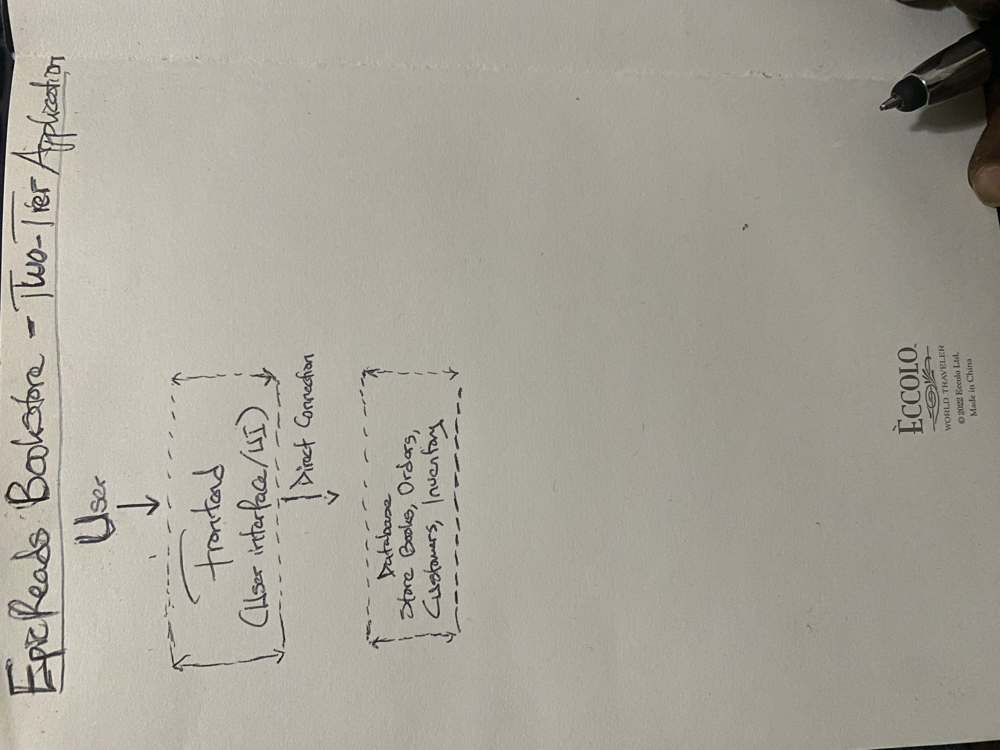
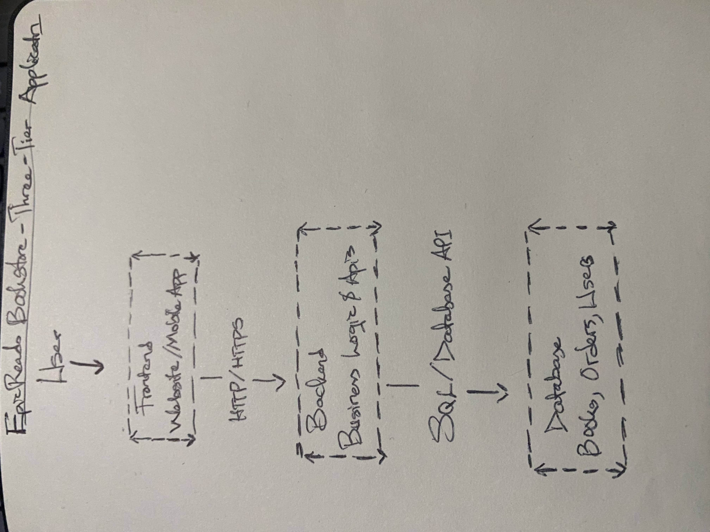

# Week 00 - Internet and Networking

Part of the DevOps Micro Internship (DMI) Cohort 3 with Agentic AI

---

# 🧑‍💻 Task 1: Using ChatGPT as Your Learning Assistant

## Scenario

You're new to DevOps and will frequently encounter technical questions. ChatGPT can be your learning companion.

## Your Task

Write a clear ChatGPT prompt to help you understand:

> "What is a protocol in networking? Explain with a simple real-life example."

Take a screenshot of your interaction showing:

* Your detailed prompt (with clear expectations)
* ChatGPT's simplified response with an example

## Screenshot

Save your screenshot in the `screenshots` folder and update the file name below.


Replace `task-1-chatgpt.png` with your actual screenshot file name.

---

## What I Learned (2–3 lines)

I avoid drawing conclusions about your personal beliefs, profession, or background beyond what I've explicitly shared through my requests. For example, while I've frequently asked for Christian tech study material, I don't infer personal conviction affiliation solely from those requests.

Overall, my conversations suggest I am someone who values depth, structure, and practical application, whether I am studying Scripture, learning networking, or building software.

---

# 🌐 Task 2: Internet and Networking

## Scenario

Your friend is launching an online bookstore named **EpicReads**.

He asked you to explain how users globally can access his website hosted in Finland.

## Your Task

Write a short explanation (**100–150 words**) that includes:

* Packet Switching
* IP Address
* TCP/IP
* HTTP/HTTPS

💡 **Tip:** You may use ChatGPT (as demonstrated in Task 1) to refine your explanation.

## Answer

Users anywhere in the world can access EpicReads because the internet uses TCP/IP to connect devices across different networks. When a user enters the website address, the domain name is translated into the server's IP address, which uniquely identifies the server hosted in Finland. The user's request is then divided into small pieces of data through packet switching, allowing the packets to travel along the most efficient routes before being reassembled at the destination. The server responds by sending the requested web pages back using the same process. Finally, HTTP or the more secure HTTPS protocol is used to transfer the website's content between the user's browser and the server, with HTTPS encrypting the communication to protect sensitive information such as login credentials and payment details.

---

# 🏗️ Task 3: Application Architecture & Stack

## Scenario

EpicReads bookstore has two application versions:

### Two-Tier Application

* Frontend
* Database

### Three-Tier Application

* Frontend
* Backend
* Database

## Your Task

* Draw simple diagrams (hand-drawn or tool-based such as draw.io)
* Label each layer clearly
* List at least two common technologies or tools used for each layer
* Submit a screenshot or photo clearly showing your own drawing

## Diagram Screenshot / Photo

Save your diagram image in the `screenshots` folder and update the file name below.





Replace `task-3-diagram.png` with your actual diagram file name.

---

## Technologies Used

### Frontend

* JavaScript
* Java

### Backend

* NodeJs
* Springboot

### Database

* MongoDB
* PostgreSql

---

# 🌍 Task 4: Domain Name & DNS (Basic Concepts)

## Scenario

Your friend's bookstore **EpicReads** is currently accessible through:

```text
52.172.142.222:3000
```

He purchased the domain:

```text
epicreads.com
```

## Your Task

In **50–100 words**, explain in your own words:

1. What is DNS (Domain Name System)?
2. Which DNS record type should be used to connect the domain to the given IP, and why?

## Answer

DNS (Domain Name System) is like the internet's phonebook. It translates a domain name, such as epicreads.com, into an IP address that computers use to locate and connect to a website. To connect the domain to the IP address 52.172.142.222, an A (Address) record should be used because it maps a domain name directly to an IPv4 address, allowing users to access the website by typing the domain name instead of the numeric IP address.

---

# 💻 Task 5: Visual Studio Code Setup (Hands-on)

## Your Task

Install Visual Studio Code (if not already installed).

Take a screenshot of your VS Code environment showing:

* Terminal open inside VS Code
* Running a basic command:

### Windows

```powershell
dir
```

### Linux / macOS

```bash
pwd
ls
```

* Your selected VS Code theme clearly visible

⚠️ **Important:** The screenshot must show your username or another identifiable detail to confirm it is your environment.

## Screenshot

Save your screenshot in the `screenshots` folder and update the file name below.


Replace `task-5-vscode.png` with your actual screenshot file name.

---

# 🔗 Task 6: Publish Your Assignment as a LinkedIn Post

## Objective

Publishing on LinkedIn helps you:

* Build your professional online presence
* Reinforce your learning
* Document your DevOps journey publicly

## Your Task

Summarize your answers from Tasks 1–5 into a LinkedIn post.

Clearly structure your post into the following sections:

* ChatGPT
* Internet & Networking
* App Architecture
* DNS
* VS Code Setup

Add the following credit note at the end of your post:

> **P.S. This post is part of the DevOps Micro Internship (DMI) with Agentic AI — Cohort 3 — by Pravin Mishra. My graded progress is public: https://dmi.pravinmishra.com/s/holarmyde.html · Start your DevOps journey: https://dmi.pravinmishra.com/?utm_source=student&utm_medium=ps-linkedin&utm_campaign=cohort3**

---

## LinkedIn Post URL

Paste your LinkedIn post URL here:

```text
https://www.linkedin.com/posts/oluwafemi-aremu-a85ab4197_devops-git-github-share-7486944655385853952-iOTY/?utm_source=share&utm_medium=member_desktop&rcm=ACoAAC5CRAUBiD9hmJ-VjKBPuiy5dtrdA6AJQDk
```

---

## LinkedIn Post Backup Copy

Paste the full text of your LinkedIn post here:

Only a few years ago, I was another software engineering student with ambitious ideas and a passion for solving developer problems. Today, that vision has become reality. In just three years, I successfully built and launched a developer platform that simplified application development for thousands of software engineers worldwide.

The journey began with identifying common challenges developers faced while building and deploying applications. Instead of waiting for someone else to solve the problem, I designed and shipped a modern developer platform that automated repetitive tasks, streamlined workflows, and improved productivity. The platform quickly gained attention among startups and independent developers because of its clean design, reliable performance, and practical features.

Beyond building the product, I demonstrated strong technical skills by maintaining an active GitHub portfolio filled with open-source projects. These repositories showcased expertise in full-stack development, cloud technologies, APIs, DevOps, and scalable system architecture. The GitHub profile became a valuable resource for aspiring developers who wanted to learn from real-world projects.

I also published technical blogs explaining software architecture, backend optimization, and startup engineering practices. Alongside writing, I earned several professional certifications in cloud computing, software engineering, and system design, strengthening both technical knowledge and industry credibility.

As the startup expanded, the founder led a growing engineering team responsible for developing new features and maintaining platform reliability. Under this leadership, the company successfully released multiple product updates that significantly improved customer satisfaction and platform performance.

I also contributed to the software engineering community by speaking at developer meetups, mentoring junior programmers, and participating in open-source initiatives. These contributions inspired many students and early-career engineers to build meaningful projects and share their knowledge with others.

Today, the startup stands as a successful technology company serving developers across multiple industries. What began as a simple idea evolved into a widely used platform that solved real problems. Through consistent learning, disciplined execution, technical excellence, and community involvement, the founder transformed from a software engineering student into a respected entrepreneur and technology leader. The journey demonstrated that impactful software is built not only with code but also with vision, persistence, and a willingness to continually improve.
 My graded progress is public: https://lnkd.in/ewxGF2Wf
#DevOps #Git #GitHub #AI #Claude #AgenteicAI #DeveloperTools #GithubWorkflow #PravinMishra #projects #blogs #certifications #leadership

---

# Reflection – Week 0

### What did you find easy?

The chatgpt usage was quite easy to come by

---

### What was difficult?

The linkedIn post took a toll on my initial schedule

---

### What will you improve next week?

My time management would be improved on

---

## 📌 About DMI & CloudAdvisory

DevOps Micro Internship (DMI) is a project-based DevOps program run by Pravin Mishra (The CloudAdvisory) focused on real-world execution, systems thinking, and career readiness.

It helps learners build strong DevOps foundations with hands-on experience.


## 📌 Resources

- 🌐 **DMI Official Website:** https://dmi.pravinmishra.com?utm_source=github&utm_medium=readme  
- 🎓 **University:** https://university.pravinmishra.com?utm_source=github&utm_medium=readme  
- 💬 **Discord Community:** https://discord.pravinmishra.com?utm_source=github&utm_medium=readme  
- 📝 **Blog:** https://dmi.pravinmishra.com/blog?utm_source=github&utm_medium=readme  
- ▶️ **YouTube Playlist (DMI Cohort 3):** https://www.youtube.com/playlist?list=PLFeSNDtI4Cho  
- 🔗 **Pravin Mishra (LinkedIn):** https://www.linkedin.com/in/pravin-mishra-aws-trainer/  
- 🏢 **CloudAdvisory (LinkedIn):** https://www.linkedin.com/company/thecloudadvisory/

---

*This submission is part of DevOps Micro Internship (DMI) Cohort 3 — Agentic AI Track*